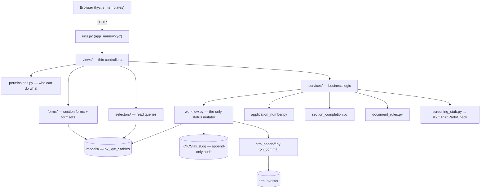
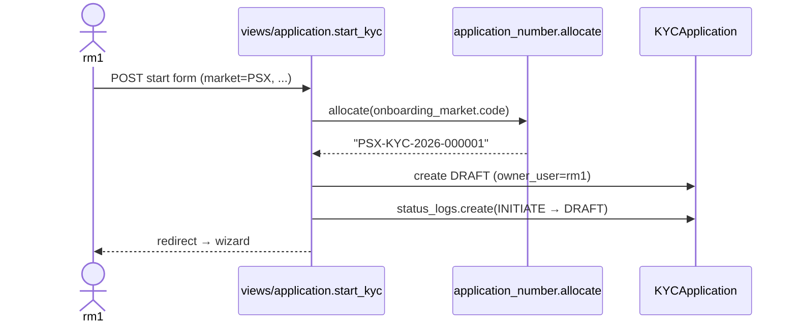
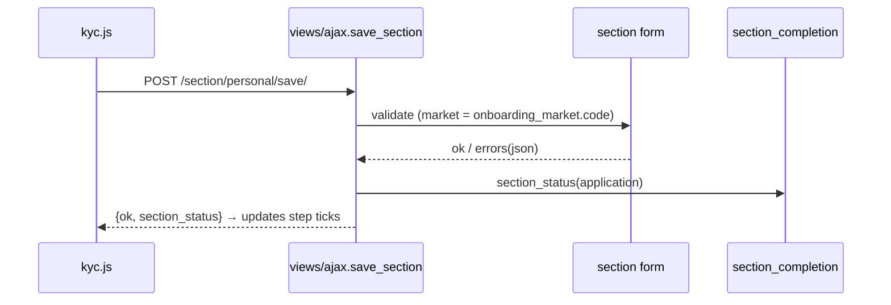
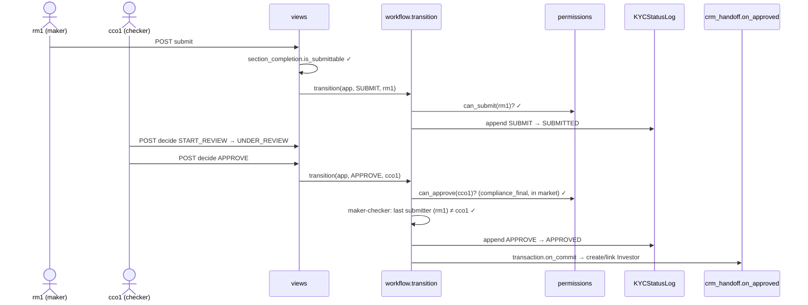

# PortX — Governance / KYC Module

**App label:** `kyc`  ·  **Python package:** `governance.kyc`  ·  **DB schema:** `portx`  ·  **Table prefix:** `px_kyc_*`

The KYC module is the **compliance onboarding system of record** for PortX. It verifies an individual client — identity, residence, tax status, source of wealth, documents — and runs that file through a **role-gated, audited review-and-approval lifecycle** before the client can be onboarded to any market (PSX, US, GCC, SARWA). KYC is the single source of truth for compliance status; on approval it hands a minimal record to CRM and stops there (one-way, no reverse sync).

Two integrity guarantees define the module:

- **Process integrity** — only one function (`services/workflow.py::transition`) may change an application's status, it enforces a legal transition map plus separation-of-duties (maker-checker), and every change is written to an append-only log.
- **Data integrity** — database CHECK constraints enforce share totals, date ordering, and one-primary-bank rules; the status log is immutable.

---

## 1. Layered architecture

Requests flow top-to-bottom. Views are deliberately thin; all logic lives in services/selectors; models hold data and invariants.

**Golden rules (do not break):**
1. Status changes go through `workflow.transition` / `workflow.supersede` only. Never set `application_status` directly anywhere else.
2. Views authenticate, call a service/selector, and render. No business logic in views.
3. `KYCStatusLog` is append-only — never updated or deleted.
4. Authorization is centralized in `permissions.py`. No ad-hoc role checks elsewhere.
5. Market is never branched at the API boundary; market differences are data (`onboarding_market`) or data-driven rules (`document_rules`).

---

## 2. File / responsibility reference

| Path | Responsibility | Key triggers / called by |
|---|---|---|
| `choices.py` | Single source of every enum (statuses, actions, doc types, roles mirror). | imported everywhere |
| `constants.py` | Non-enum constants (number template, joint-holder cap, share tolerance, wizard sections). | services, forms |
| `models/base.py` | `KYCAuditBase` — FK `created_by`/`updated_by` to auth user + timestamps. | every model except `KYCStatusLog` |
| `models/application.py` | `KYCApplication` — the **spine**. Owns lifecycle, links owner/investor/market. `applicant_name` property. `clean()` blocks self-supersede. | the hub of the app |
| `models/*.py` | Section + child tables (personal, residence, residency_tax, employment, source_of_wealth, identity_document, joint_holder, nominee, bank_account, poa, documents, screening). | via spine relations |
| `models/status_log.py` | `KYCStatusLog` — immutable transition record (no audit base, no updated_* cols). | written by `workflow` |
| `permissions.py` | Capability resolution via `StaffProfile`; helpers for broad gating, role codes for terminal authority; market scoping. | views + workflow |
| `services/workflow.py` | **The status engine.** Transition map, authorization, maker-checker, status logging, approval handoff trigger, re-KYC supersede. | `views/application.py`, `views/review.py` |
| `services/application_number.py` | Race-safe `{MARKET}-KYC-{YEAR}-{NNNNNN}` allocation, per-market-per-year. | `start_kyc`, `supersede` |
| `services/section_completion.py` | Per-section completion + `is_submittable` (incl. joint-holder share-sum). | wizard, submit gate, AJAX validate |
| `services/document_rules.py` | Required/missing documents, data-driven by flags + market. | section completion, requirements UI |
| `services/crm_handoff.py` | One-way Investor create/link on approval (idempotent, email-guarded). | `workflow` on APPROVED (via `on_commit`) |
| `services/screening_stub.py` | Phase-2 placeholder; records a PENDING `KYCThirdPartyCheck`. | manual / future |
| `services/exceptions.py` | Typed errors: `TransitionNotAllowed`, `KYCPermissionDenied`, `SeparationOfDutiesError`, `ApplicationNumberError`. | services |
| `selectors/dashboard.py` | Role/market-scoped status counts + recent applications. | dashboard view |
| `selectors/review_queue.py` | Review queue + escalated queue, scoped. | review/escalations views |
| `forms/section_1..4.py` | Section ModelForms (PSX field gating by market code). | wizard, AJAX save |
| `forms/dynamic_rows.py` | 7 inline formsets + `GROUP_FORMSETS`/`GROUP_TEMPLATES` registry + `build_formsets`. | AJAX add/save rows |
| `views/application.py` | `start_kyc`, `wizard`, `submit_application`. | URLs |
| `views/review.py` | `review_queue`, `escalations`, `decide`. | URLs |
| `views/ajax.py` | `save_section`, `validate_application`, `add_row`, `save_rows`. | kyc.js |
| `views/dashboard.py` / `views/documents.py` | dashboard render; document upload/verify. | URLs |
| `urls.py` | Routes (namespace `kyc:`). **Must be `include()`d in the root URLconf.** | project urls |
| `templates/kyc/base.html` | Standalone KYC shell (IBOR look, KYC nav). **Never extends anything.** | all pages |
| `templates/kyc/base_kyc.html` | Thin layer over `base.html` adding `kyc.css` + `kyc.js` for the wizard. | wizard/review/escalations |
| `static/kyc/js/kyc.js` | AJAX section save, row add/remove, review decisions. | wizard, queues |
| `admin/*.py` | Audit-friendly admin; `KYCStatusLog` is read-only. | Django admin |

---

## 3. Data model

`KYCApplication` is the spine. One-to-one sections hold core data; child tables hold repeating groups. Joint holders own their own identity documents and tax-residency rows.

```mermaid
erDiagram
    KYCApplication ||--o| KYCPersonalInfo : "1:1"
    KYCApplication ||--o| KYCResidence : "1:1"
    KYCApplication ||--o| KYCEmployment : "1:1"
    KYCApplication ||--o| KYCSourceOfWealth : "1:1"
    KYCApplication ||--o{ KYCIdentityDocument : "child"
    KYCApplication ||--o{ KYCResidencyTax : "child"
    KYCApplication ||--o{ KYCJointHolder : "child"
    KYCApplication ||--o{ KYCNominee : "child"
    KYCApplication ||--o{ KYCBankAccount : "child"
    KYCApplication ||--o{ KYCPowerOfAttorney : "child"
    KYCApplication ||--o{ KYCDocument : "attachments"
    KYCApplication ||--o{ KYCStatusLog : "audit"
    KYCApplication ||--o{ KYCThirdPartyCheck : "screening"
    KYCApplication }o--|| ExecutionVenue : "onboarding_market (FK, PROTECT)"
    KYCApplication }o--o| Investor : "investor (FK, SET_NULL)"
    KYCApplication }o--o| KYCReferralSource : "referral_source (FK, SET_NULL)"
    KYCApplication }o--o| KYCApplication : "supersedes (self)"
    KYCJointHolder ||--o{ KYCIdentityDocument : "owns"
    KYCJointHolder ||--o{ KYCResidencyTax : "owns"
```

**Spine fields of note:** `application_number` (unique, allocated at init), `onboarding_market` (FK → `masters.ExecutionVenue`, required), `application_status` (mutated only by workflow), `client_classification` (RET/PRO/ECP), `account_holding_type` (SINGLE/JOINT), `aml_risk_rating` (set during review, nullable), `version` + `supersedes` (re-KYC lineage), `market_extra` (documented JSON escape hatch).

**Database invariants (CHECK / UNIQUE constraints):** joint-holder sequence 2–5 and unique per application; share percentages 0–100 on personal/joint/nominee; identity-doc and POA passport `expiry ≥ issue`; tax-residency requires a TIN or an unavailable reason; screening `completed ≥ requested`; exactly one primary bank account per application.

---

## 4. Application lifecycle (state machine)

Seven states. Only `workflow.transition` moves between them; `INITIATE` is logged at creation, `SUPERSEDE` forks a new versioned DRAFT.

```mermaid
stateDiagram-v2
    [*] --> DRAFT: INITIATE (logged at creation)
    DRAFT --> SUBMITTED: SUBMIT — owner / rm
    SUBMITTED --> UNDER_REVIEW: START_REVIEW — compliance
    UNDER_REVIEW --> ADDL_INFO: REQUEST_INFO — compliance
    ADDL_INFO --> UNDER_REVIEW: RESUBMIT — owner / rm
    UNDER_REVIEW --> ESCALATED: ESCALATE — compliance
    UNDER_REVIEW --> APPROVED: APPROVE — compliance_final
    ESCALATED --> APPROVED: APPROVE — senior_mgmt / compliance_final
    UNDER_REVIEW --> REJECTED: REJECT — compliance_final / senior_mgmt
    ESCALATED --> REJECTED: REJECT — compliance_final / senior_mgmt
    APPROVED --> [*]
    REJECTED --> [*]
    APPROVED --> DRAFT: SUPERSEDE — re-KYC, version+1
    REJECTED --> DRAFT: SUPERSEDE — re-KYC, version+1
```

The legal pairs live in `workflow.TRANSITIONS`; the authorizer per action lives in `workflow._PERMISSION_FOR_ACTION`. Any `(status, action)` not in the map raises `TransitionNotAllowed`.

---

## 5. Key flows (triggers & sequences)

### 5.1 Start → wizard

`start_kyc` (POST) creates a DRAFT, allocates the number, and logs `INITIATE`, then redirects to the wizard.

### 5.2 Wizard section save (AJAX, no reload)

Each section posts independently. `add_row` injects a blank formset row; `save_rows` persists all repeating groups.

### 5.3 Submit → review → approve (maker-checker + handoff)

The submit endpoint re-checks completeness server-side (never trusts the disabled button). Approval enforces that the approver is not the submitter, then fires the CRM handoff after commit.

If `rm1` attempts the approval, `workflow` raises `SeparationOfDutiesError` (submitter ≠ approver). That is the central control.

---

## 6. Roles & permissions

**Roles (`users.UserRole`):** `client`, `rm`, `compliance_l1`, `senior_mgmt`, `compliance_final`, `admin`.
**Markets (`StaffProfile.market`):** `PSX`, `US`, `GCC`, `SARWA`, `ALL`.

`permissions.py` resolves capability through `user.staff_profile`: **helpers** (`is_rm`, `is_compliance`, `is_senior_mgmt`) for broad gating; **exact role codes** for terminal authority (`compliance_final` signs off). Market scoping compares `StaffProfile.market` to `application.onboarding_market.code` (`ALL` = cross-market).

| Capability | Who | Notes |
|---|---|---|
| `can_view` | owner · market-scoped staff · admin | clients see only their own |
| `can_edit` | owner or rm | only in `DRAFT` / `ADDL_INFO` |
| `can_submit` | owner or rm | gated by `is_submittable` server-side |
| `can_start_review` / `request_info` / `escalate` | compliance, in market | broad gating via `is_compliance` |
| `can_approve` | `compliance_final` (UNDER_REVIEW); `senior_mgmt` or `compliance_final` (ESCALATED) | + market scope; + maker-checker |
| `can_reject` | `compliance_final` or `senior_mgmt` | + market scope; + maker-checker |
| `can_supersede` | admin or compliance | re-KYC |

**Maker-checker:** enforced in `workflow` for `APPROVE`/`REJECT` — the actor cannot equal the most-recent `SUBMIT`/`RESUBMIT` actor (`INITIATE` is excluded, so creation does not count as submission).

---

## 7. Extension guide

**Add a market.** Create an `ExecutionVenue` row whose `code` is exactly `PSX`/`US`/`GCC`/`SARWA` (the scoping + PSX-gating logic compares on that code). No KYC code change needed — markets are data.

**Add a one-to-one section.** New model (extend `KYCAuditBase`, OneToOne to `KYCApplication`) → ModelForm → register in `views/ajax._SECTION_FORMS` → add a completion check in `section_completion` → add a card to the wizard template.

**Add a repeating group.** New child model (FK to `KYCApplication`) → `inlineformset_factory` in `forms/dynamic_rows.py` → add to `GROUP_FORMSETS` + `GROUP_TEMPLATES` → create `templates/kyc/partials/_<group>_row.html` (always render bound `{{ form.* }}` fields; `data-group` must equal the formset prefix for `kyc.js`).

**Add a workflow state or action.** Add the enum to `choices.py` → add the legal `(from, action) → to` pair(s) to `workflow.TRANSITIONS` → add the action's authorizer to `workflow._PERMISSION_FOR_ACTION` → expose it in the relevant view/template.

**Wire real AML screening.** Replace `services/screening_stub.py` with a provider call that updates `KYCThirdPartyCheck.outcome`; the table/enum surface already exists, so no migration of that surface is needed.

**Add a required document rule.** Extend `services/document_rules.required_documents` with the new condition; it is data-driven and per-market.

---

## 8. Bug-review checklist / known gotchas

Things that are correct today but easy to regress — check these first when something misbehaves:

1. **`onboarding_market` is a FK — always use `.code` for string comparisons.** Passing the `ExecutionVenue` object where a market code string is expected silently breaks PSX field-gating, market scoping, and number allocation. Touch points: `views/ajax.save_section` (`market=...code`), `permissions.in_market_scope`, `application_number.allocate`, every section-form `market=` instantiation.
2. **Reference data must exist.** Empty `ExecutionVenue` → only some markets in the dropdown; empty `KYCReferralSource` → empty referral dropdown (it is nullable, so submission still works). Manage both via Django admin.
3. **Root URLconf include.** `path("governance/kyc/", include("governance.kyc.urls"))` must be present, or every `kyc:` route 404s / `NoReverseMatch`.
4. **`base.html` must never ``.** It is a full standalone document; a stray extends-self causes a template-recursion error. Child pages extend it; it extends nothing.
5. **Wizard `<form>` needs `enctype="multipart/form-data"`** or document-row file uploads silently post empty.
6. **`transaction.on_commit` handoff** does not fire inside a Django `TestCase` (atomic) unless you use `captureOnCommitCallbacks`. Use `TransactionTestCase` or the capture helper when testing approval → Investor.
7. **`crm_handoff` email guard.** `get_or_create(email=None)` would merge distinct null-email applicants — keep the `if email:` branch that creates fresh when there is no email.
8. **Template field names track the model.** `aml_risk_rating` (not `risk_rating`); `applicant_name` is a model property derived from `personal_info`. Missing attrs render as empty (no error) — so a wrong name shows blank, not a 500.
9. **Single document path.** `KYCDocument` can be created via the `document` formset *and* `views/documents.upload_document`. Pick one to avoid divergent behavior.
10. **Reverse one-to-one access** uses `getattr(app, "personal_info", None)` — safe because Django's `RelatedObjectDoesNotExist` subclasses `AttributeError`.

---

## 9. Testing

Recommended coverage (none shipped yet — `tests/` is a stub):

- **Workflow:** every legal transition; every illegal pair raises `TransitionNotAllowed`; `get_allowed_actions` per state/role.
- **Maker-checker:** submitter cannot approve/reject own application (`SeparationOfDutiesError`); a different `compliance_final` can.
- **Permissions matrix:** each `can_*` against each role × in/out of market scope.
- **Application number:** format, per-market-per-year sequencing, uniqueness under concurrency.
- **Section completion:** `is_submittable` false until sections complete; joint-holder shares must total 100.
- **CRM handoff:** Investor created/linked on approval (use `captureOnCommitCallbacks`); idempotent on re-approval; null-email path does not merge.

**Manual smoke (front-end):** as `rm1` — Submit KYC (PSX) → wizard (add a joint holder + a document, save) → Submit; attempt self-approve (must fail) → as `cco1` Review Queue → Approve; confirm dashboard counts update and `investor_id` populates.

---

## 10. Glossary

- **Maker-checker** — separation of duties: the person who submits a version cannot approve/reject it.
- **Section** — a one-to-one block of the application (personal, residence, employment, source of wealth).
- **Repeating group** — a child table with many rows per application (identity docs, joint holders, nominees, bank accounts, POA, tax residencies, documents).
- **Handoff** — the one-way creation/linking of a CRM `Investor` on approval.
- **Supersede / re-KYC** — forking a new versioned DRAFT from an approved/rejected application.
- **Onboarding market** — the `ExecutionVenue` the application is raised for; drives scoping and market-specific gating via its `code`.

---

*Maintained alongside the `governance.kyc` app. When you change a transition, a permission, a constraint, or the data model, update the relevant section above in the same PR.*